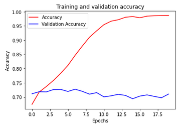

# Sentiment-Analysis

[](LICENSE)

## Introduction

We experiment how to use Neural Network and [GloVe](https://www.aclweb.org/anthology/D14-1162/) word vector representations for Sentiment Analysis.

The dataset is [Sentiment140](http://www.sentiment140.com/), 
which is a collection of 1.6 million tweets that have been tagged as either positive or negative.

GloVe is available for [download](https://nlp.stanford.edu/projects/glove/) from Stanford. 
We use the "100 dimension" version in "glove.6B.zip".

## Neural Network

We constructed a simple LSTM Neural Network as below:
```
Model: "sequential_4"
_________________________________________________________________
Layer (type)                 Output Shape              Param #   
=================================================================
embedding_4 (Embedding)      (None, 16, 100)           7648500   
_________________________________________________________________
bidirectional_7 (Bidirection (None, 16, 256)           234496    
_________________________________________________________________
dropout_2 (Dropout)          (None, 16, 256)           0         
_________________________________________________________________
bidirectional_8 (Bidirection (None, 256)               394240    
_________________________________________________________________
dropout_3 (Dropout)          (None, 256)               0         
_________________________________________________________________
dense_7 (Dense)              (None, 1)                 257       
=================================================================
Total params: 8,277,493
Trainable params: 8,277,493
Non-trainable params: 0
```
## Performance

Our simple LSTM model achieves 70% accuracy.



## Other Popular Techniques

1. SVM: 
   - accuracy - 85%    
   - training - very long

2. Maximum Entropy
   - accuracy - 83%    
   - training - very long

3. [Lexicon & Rule-based](https://github.com/cjhutto/vaderSentiment)
   - accuracy - 80%    
   - labor consuming
   
4. [Naive Bayes](https://github.com/vivekn/sentiment): 
   - accuracy - 70% ~ 80%   
   - fast execution

5. Our simple LSTM:
   - accuracy - 70%    
   - training - fast
   
## Future Work

We will continue to explore how to improve the accuracy,
which includes applying various pre-processing steps like URLs, handles, Hashtags, punctuations, emoticons, twitter specific terms and stemming,
investigating the following features - unigrams, bigrams, trigrams and negation detection, see https://github.com/ayushoriginal/Sentiment-Analysis-Twitter.

We will also experiment with transfer learning sophisticated Neural Networks, such as Attension Model.

## Reference

- [GloVe: Global Vectors for Word Representation](https://www.aclweb.org/anthology/D14-1162/)
- [VADER: A Parsimonious Rule-based Model for Sentiment Analysis of Social Media Text](https://www.researchgate.net/publication/275828927_VADER_A_Parsimonious_Rule-based_Model_for_Sentiment_Analysis_of_Social_Media_Text)
- [Fast and accurate sentiment classification using an enhanced Naive Bayes model](https://arxiv.org/abs/1305.6143)
