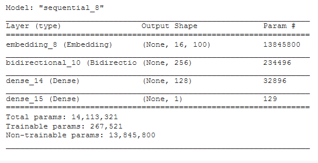

# Sentiment-Analysis

## Introduction

We demonstrate how to use [GloVe](https://www.aclweb.org/anthology/D14-1162/) word vector representations in Sentiment Analysis.

The dataset is [Sentiment140](http://www.sentiment140.com/), 
which is a collection of 1.6 million tweets that have been tagged as either positive or negative.

GloVe is available for [download](https://nlp.stanford.edu/projects/glove/) from Stanford. 
We use the "100 dimension" version in "glove.6B.zip".

## Neural Network

We constructed a simple LSTM Neural Network as below:

## Performance

Our simple 4 layer LSTM model achieves 70% accuracy.

## Other Techniques
Comparison with "state-of-the-art" techniques:

1. SVM: 
   - accuracy - 85%    
   - training - very long

2. Maximum Entropy
   - accuracy - 83%    
   - training - very long

3. Lexicon & Rule-based
   - accuracy - 80%    
   - labor consuming
   
4. Bayers: 
   - accuracy - 70% ~ 80%   
   - fast execution

## Future Work

We will continue to explore how to improve the accuracy,
such as more complexed NN, data cleaning, stemming, removing URL, removing handle, replacing emoji with word, transfer learning the word embedding etc..

